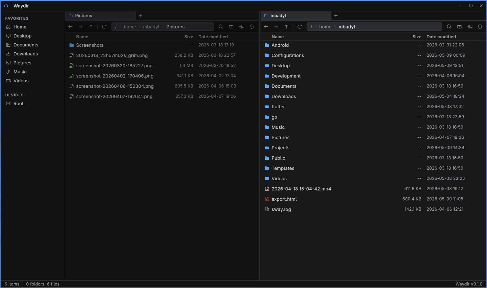
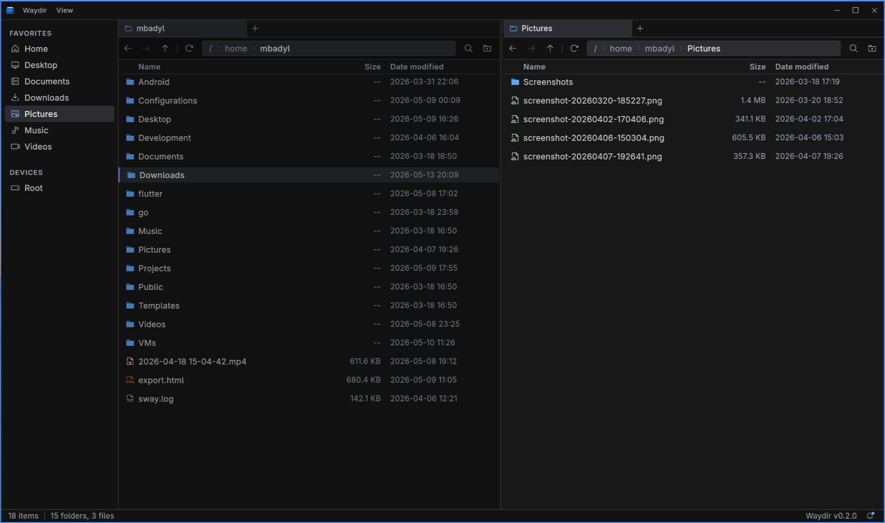

<div align="center">

# Waydir

A fast, keyboard-driven desktop file manager built with Flutter.

[](https://flutter.dev)
[](https://dart.dev)
[]()

</div>





## What is Waydir?

Waydir is the file manager I wanted on my own machine: hands stay on the keyboard, the UI gets out of the way, and opening a 100k-file directory doesn't lock up the window.

It's built on Flutter so the same binary runs on Linux, Windows and macOS from one codebase.

## Install

Download the latest build from the [Releases](https://github.com/mikolajbadyl/waydir/releases) page.

Linux builds are available as `.deb`, `.rpm`, and `.tar.gz` packages. Windows builds are available as an `.exe` installer and a `.zip` archive. macOS builds are available as a `.dmg` package.

On Linux, the portable archive can be unpacked and launched directly:

```bash
tar -xzf waydir-*-linux-x64.tar.gz
./waydir
```

## Features

- Dual-pane navigation with tabs
- Keyboard-driven nav, selection, and file ops
- Background-isolate directory scanning (no UI jank)
- Copy / move / delete with progress
- Clipboard integration
- Minimal dark interface
- Linux, Windows and macOS builds

## Development

Requirements:

- Flutter 3.35+
- Dart 3.10+

```bash
git clone https://github.com/mikolajbadyl/waydir.git
cd waydir
flutter pub get
flutter run -d linux
```

Run checks before opening a PR:

```bash
dart format .
flutter analyze
flutter test
```

Build a release binary locally:

```bash
flutter build linux
flutter build windows
flutter build macos
```

## Contributing

PRs are welcome. Before opening one:

1. `dart format .`
2. `flutter analyze` - must be clean.
3. `flutter test` - must be green.

CI runs the same three on every PR (see `.github/workflows/`). Keep commits focused; small PRs land faster than big ones.

If you're picking up something non-trivial, open an issue first so we can sync on the approach.

## License

[MIT](LICENSE)

### Bundled third-party code
